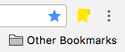
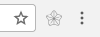
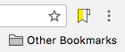
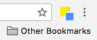

# Epimarks
Everyone loves series. TV shows 📺, novels 📖, movies 🎬.

But when we enjoy them online, it's always annoying to remember which EPISODE we were on last time.

You might think "Yay, I can save where I am using BOOKMARKS." But then everytime you watch new episodes, you have to copy the web address, edit the old bookmark, paste the web address and save. Or with __Epimarks__, simply click the smart button , your bookmark is already up-to-date!

Say goodbye to the dumb built-in bookmark star. Welcome Epimarks!

## Usage

### Epimark new series
1. Go to the episode page you want to keep track on.
2. Click Epimarks  and a confirm window will pop up.
3. In the window, browse to another episode of the series and click Epimarks again. 
4. Your series is now epimarked! 

> Note: the bookmark of epimarked series is saved in the _Other Bookmarks_ folder.

### Update to new episode
1. At a new episode of an Epimarked series, you'll find this. 
2. Simply click Epimarks to keep the bookmark up-to-date! 

## Installation
1. [Download](https://github.com/frankyjuang/Epimarks/archive/master.zip) source code as zip file.
2. Navigate to chrome://extensions
3. Expand the Developer dropdown menu and click “Load Unpacked Extension”
4. Navigate to the local folder containing the extension’s code and click Ok
5. Assuming there are no errors, the extension should load into your browser

## Quick questions
### Why do I need to open another episode to confirm?
With two episodes, Epimarks now knows which series you want to follow!

### Where are all my episodes stored?
In the folder _Other Bookmarks_! Head there and resume your watching NOW!
